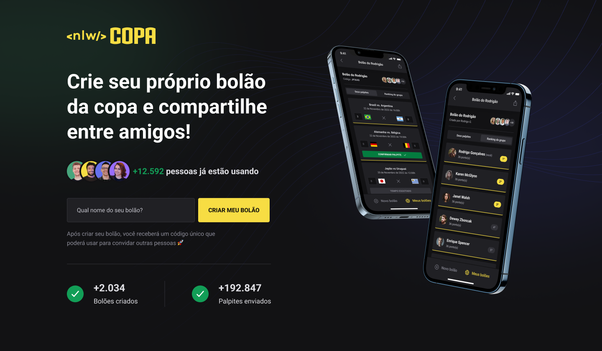

<p align="center">
  
  <hr />
</p>
<p align="center">
  Projeto desenvolvido durante a NLW (Next Level Week) da Rocketseat
</p>
<br>

# Sobre o projeto
Uma plataforma que permite que usuários criem e participem de bolões para a copa do mundo 2022. A aplicação web tem o objetivo de apenas criar bolões, enquanto o app mobile possui todas as outras funcionalidades do sistema



# Tecnologias utilizadas
- Typescript
- React
- React Native
- Native Base
- NextJs
- Tailwind CSS
- Expo
- Fastify
- Prisma
- SQLite


# Inicialização
> Atenção: utilize a versão 18 do node para rodar o server e a versão 16 para rodar o web e mobile
## Server

entre na pasta `server` presente no diretório raiz, e rode o comando para instalar as dependências:
```bash
npm i
```
Agora para criar o banco de dados, rode o comando:
```bash 
npx prisma migrate dev
```
Por fim para iniciar o servidor, rode o comando:
```bash
npm run dev
```

## Web
Para rodar o projeto web, entre na pasta `web` presente no diretório raiz, e rode o comando para instalar as dependências:
```bash
npm i
```
Agora para iniciar o projeto, rode o comando:
```bash
npm run dev
```
> Atenção: não esqueça de iniciar o servidor antes de iniciar o projeto web

## Mobile
Para rodar o projeto mobile você precisará baixar o app [Expo Go](https://expo.dev/client).
Após baixar o app, entre na pasta `mobile` presente no diretório raiz, e rode o comando para instalar as dependências:
```bash
npm i
```
Agora para iniciar o projeto, rode o comando:
```bash
npx expo start 
```
> Atenção: não esqueça de iniciar o servidor antes de iniciar o projeto mobile